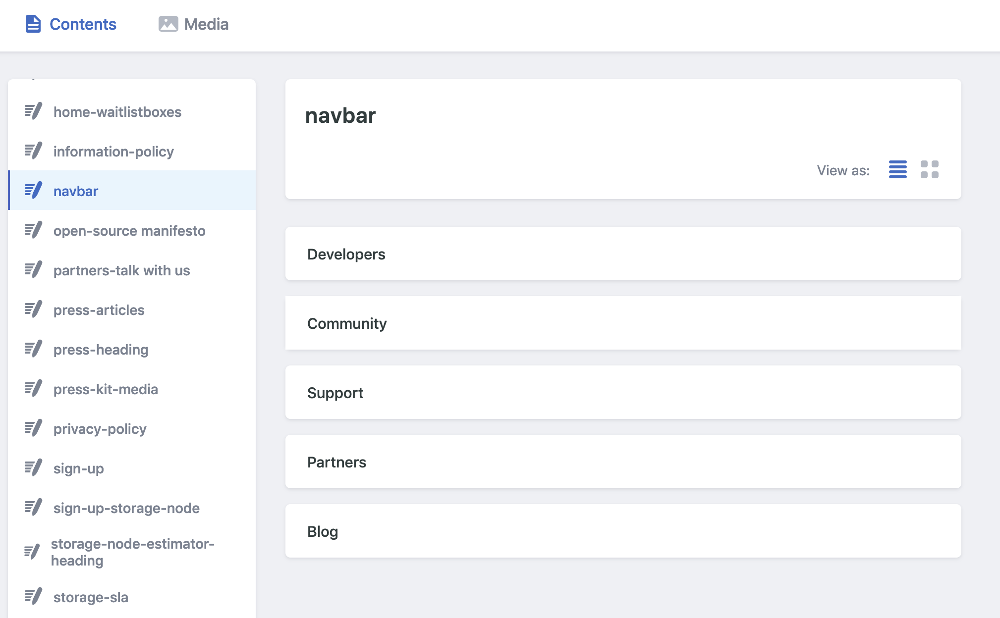
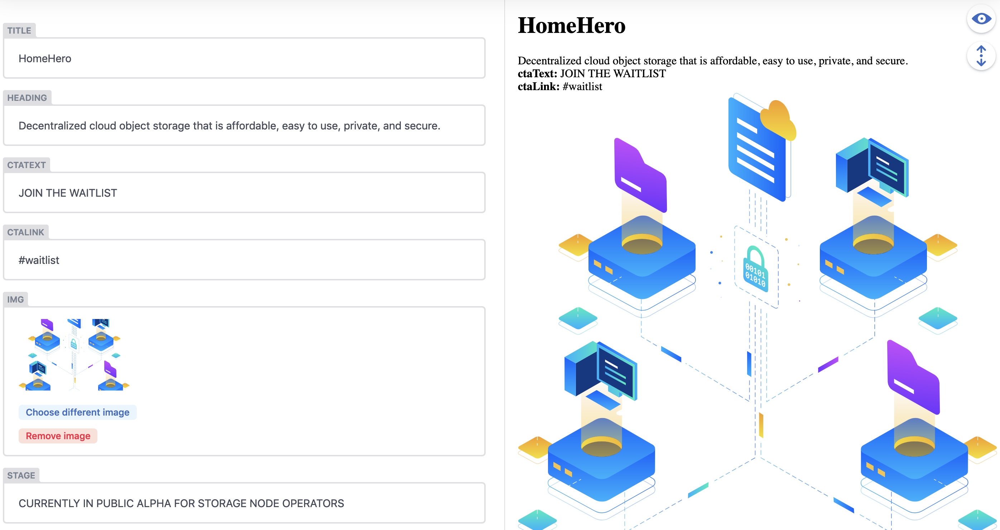
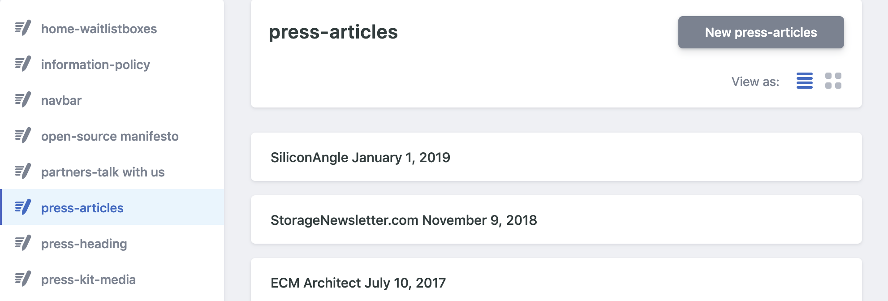
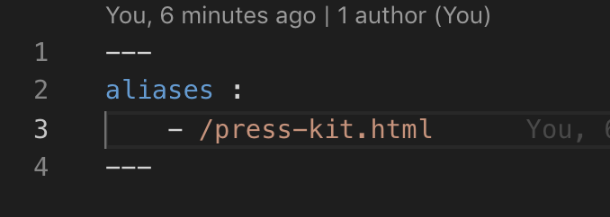
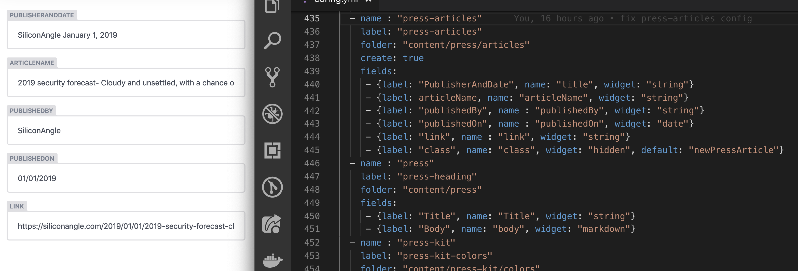

# Storj Hugo

## Table Of Contents
---
- Improvements
- [How to for Marketing](#mar)
- [How to for Engineering](#eng)

## Improvements
---

### Modular codebase

Pages are broken down into infinitely re-usable sections called "partials".

This helps prevent wasting time skimming 1000+ lines of html for a closing div tag and has substiantally reduced
the number of lines of code.

### CMS for Marketing Team
The Website now has a CMS where the marketing team can update the verbage and images on the website.

The website should accurately reflect our current stage of production. Twice as many updates can be completed in half the time now that the marketing team can make them directly.

### Faster Web Development
In the screenshot below on the left hand side you can see the footer partial which has some hugo logic in it that allows you to propogate new elements based on certain data. On the right hand side you see two pages both using that footer partial. Now any updates made to the footer automatically update across all pages using that partial. This saves a lot of time from having to make the update on each page manually.

## <a name="mar">How to for Marketing</a>
---

If you've been whitlisted, you should be able to access the CMS by appending "/admin" to the site's url the same way you do for the blog.

Once in, you'll see the collections on your left. These represent either a whole page, or a certain part/section of a page. When you click on a collection you'll see the elements that make it up in the form of editable markdown files in the middle of the screen.

You can create a new article by clicking on "new press articles" in the screenshot above.
Adding new media articles to our press page can be done now in the same time it takes to .........Ohhh, idk, put it in a google sheet?

Publish your changes using the "publish" button in the upper right hand corner. This pushes the update to the website live in realtime.

NOTE: The preview section is not meant to show you a preview of what the page would look like with adjustments. It is just rendering your input as a markdown file allowing you to format your input and check selected images are working.

## <a name="eng">How to for Engineering</a>
---

### When creating a new page 
---

        mkdir content/nameOfPageYouWantToMake && touch content/nameOfPageYouWantToMake/nameOfPageYouWantToMake.md

Note: If you're not sure what front matter this page is going to be getting just yet. Just write a place holder to it for now.

        echo -e "---\n---" > content/nameOfDirYouMadeInLastStep/nameOfPageYouMadeInLastStep.md
        
Above line is the minimum front matter for the page to render.

Now make a new dir in layouts and an html file inside it that correspond to the md dir and file you just made in the above steps.

        mkdir layouts/nameYouGaveToDirInStep1 && touch layouts/nameYouGaveToDirInStep1/nameYouGaveToPageInStep1.html
        

Add permalink for the page inside the config.toml file using the existing convention

- You can now go back to the md file at

                content/nameOfDirYouMadeInFirstStep/nameOfPageYouMadeInFirstStep.md 
                
and update the front matter so you can use it as variables in your page and map them to the CMS in the [config.yml file](#cms)

### Fixing broken links and creating redirects using aliases 
---

Our old website had several pages where url's had a .html extension. We have dropped the .html extension on all urls(which can be found in the [config.toml file](https://github.com/storj/storj.io/blob/master/config.toml)). With that said, there are still existing resources out there that use some of those old urls. The easiest way to set up a redirect to fix 404's is through Hugo aliasing.

1.  

    cd /content/dirOfPageInQuestion && touch alias.md

2.  

    echo -e "---\naliases :\n\t- /pathOfOldDirToRedirectFrom.html\n---" >> alias.md 

result:

3.

    touch ../layouts/dirOfPageInQuestion/alias.html
    

**Now just leave alias.html blank and you're ready to test the redirect.**

### <a name="cms">Adjusting the CMS</a>
---

CMS config file path is 

    /static/admin/config.yml

The above screenshot helps you understand how the config file fields work. If we look at the press-articles collection's fields you can see the 

- name takes a front matter key.
- label is what you would like the value
to be called in the cms
- widget represents the data type for the user input
- hidden and default can also be used for setting default front matter key/value pairs and hiding them from being altered by user input.

### genmds.sh

You may have noticed this shell script in the repo. It's there to help you partial out pages and automates the creation of however many md files you need to do so. The script will prompt you for the data it needs and give you an opportunity to set the front matter keys and it will prompt you for values for those keys as well. I reccomend only inputting a value when prompted if you need all the md pages you're creating to share a common key/value pair to be used in some logic you define some where later.

So in a nutshell the script creates

num of md files specified in...

dir specified with...

front matter specified.

**Running the script**

                chmod +x genmds.sh && ./gendmds.sh

then just follow the prompts.
                
 
